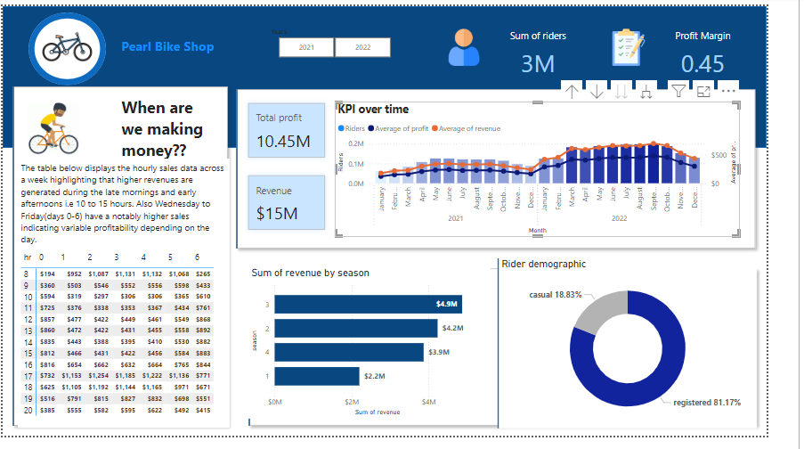

# Bike Rental Analysis

## Data analysis project: SQL & Power BI

## Table of content
- Introduction
- Email Request
- Workflow
- Recommendation

###Introduction
Pearl Bike Shop is a bicycle rental service. This dataset included time periods, seasons, weather conditions, and the number of riders.   

###Email Request
**Email Request**

Dear Data analyst.
We need a dashboard that displays our key performance metrics for informed decision-making.
Requirements
- Hourly revenue
- Profit and revenue trends
- Seasonal revenue
- Rider demographics
- Designs and aesthetics: Use our company colors and ensure the dashboard is easy to navigate.

Data source: Access to our databases will be provided.

Please provide an estimated timeline for completion and recommendation on raising prices next year.

Best regards.

###Workflow
1. Create a database
2. Develop SQL queries
3. Connect DB to power bi
4. Create a dashboard
5. Answer questions

